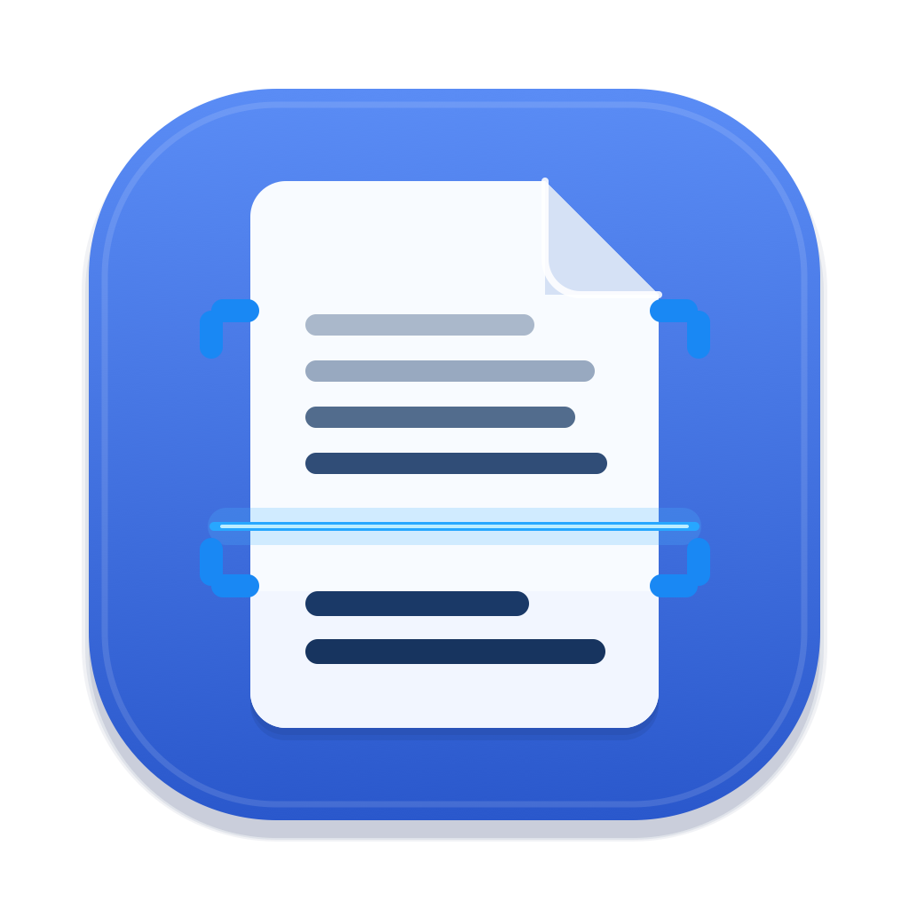

<p align="center">
  
</p>

<h1 align="center">Apple Vision OCR CLI / VOCR</h1>

<p align="center">
  <a href="https://github.com/jangisaac-dev/apple-vision-ocr-cli/actions/workflows/ci.yml"></a>
  <a href="https://github.com/jangisaac-dev/apple-vision-ocr-cli/releases/latest"></a>
  
  
  <a href="LICENSE"></a>
</p>

<p align="center"><a href="README.md">English</a> | 한국어</p>

Apple Vision을 사용하는 순수 Swift 기반 macOS OCR 도구입니다. 다음 구성 요소를 포함합니다:

- `apple-vision-ocr`: 터미널 CLI.
- `VOCR.app`: 상세 창 및 메뉴 막대 진행률 표시를 제공하는 Finder 실행형 GUI.
- `Apple Vision OCR`: 선택한 PDF 파일을 위한 단일 Finder Quick Action.

현재 릴리스: `v1.3.1`.

## 지원 범위

- 입력: PDF 파일. CLI는 한 번 실행할 때 PDF 한 개를 처리하고, VOCR과 Quick Action은 여러 PDF를 한꺼번에 선택할 수 있습니다.
- 출력: Searchable PDF, TXT 또는 둘 다.
- OCR 엔진: Apple Vision 텍스트 인식.
- 기본 언어: 한국어 및 영어(`--lang`으로 설정 가능).
- 원본 PDF는 절대로 수정되지 않습니다.

## 요구 사양

- macOS 13 이상.
- 릴리스 패키지: Apple Silicon(arm64) Mac. 별도의 빌드 도구가 필요하지 않습니다.
- 소스에서 빌드: Xcode 명령줄 도구(Command Line Tools) 또는 Swift 5.9 이상이 포함된 Xcode.

## 문서

- 사용자 가이드: `docs/user-guide.ko.md` (영어 원본: `docs/user-guide.md`)
- AI 에이전트 설치·사용 가이드(Xcode 없이 설치, CLI 입출력 규약, 종료 코드, 백그라운드 작업): `docs/ai-install-and-setup.md`(영문), 코딩 에이전트용 `AGENTS.md`
- 아키텍처 및 수정 가이드: `docs/architecture-and-modification-guide.md`
- 구현 현황: `CURRENT_STATUS.md`
- 변경 이력: `CHANGELOG.md`
- 기여 안내: `CONTRIBUTING.md`
- 영어 원문: `README.md`, `docs/user-guide.md`

## 설치

### 릴리스 패키지로 설치 (빌드 불필요)

1. [GitHub Releases](https://github.com/jangisaac-dev/apple-vision-ocr-cli/releases)에서 `VOCR-<version>-macos-arm64.zip`을 다운로드하고 압축을 풉니다.
2. `Install.command`를 이중 클릭합니다. macOS에서 실행이 차단되는 경우, 시스템 설정 > 개인정보 보호 및 보안을 열고 "그래도 열기"(Open Anyway)를 클릭한 후 다시 실행합니다(또는 아래의 터미널 명령을 사용합니다).
3. Finder에서 PDF를 선택하고 마우스 우클릭한 뒤 Quick Actions > `Apple Vision OCR`을 선택합니다.

해당 패키지에는 사전 빌드된 `VOCR.app`(`apple-vision-ocr` CLI 번들 포함)과 소스 체크아웃과 동일한 설치 프로그램이 포함되어 있으며, 아래에 나열된 경로로 설치됩니다. 앱은 임시 서명(ad-hoc signed)되어 있고 공증(notarized)을 받지 않았으므로, 설치 프로그램이 설치된 복사본에서 격리(quarantine) 속성을 제거합니다. 터미널을 사용하는 대안은 다음과 같습니다:

```bash
xattr -dr com.apple.quarantine VOCR-<version>-macos-arm64
VOCR-<version>-macos-arm64/install-vocr-quick-action.sh
```

메인테이너는 `scripts/make-release-package.sh`로 패키지를 빌드합니다(출력 경로: `.release/`).

### 소스에서 설치

체크아웃 디렉터리에서 빌드하고 실행합니다:

```bash
swift run apple-vision-ocr input.pdf
```

현재 macOS 사용자를 위해 CLI, `VOCR.app`, Finder Quick Action을 설치합니다:

```bash
scripts/install-vocr-quick-action.sh
```

기본적으로 설치 프로그램은 사용자 로컬 파일만 작성합니다:

```text
~/Applications/VOCR.app
~/.local/bin/apple-vision-ocr
~/.local/bin/vocr-finder-action
~/Library/Services/Apple Vision OCR.workflow
```

앱 및 바이너리 설치 경로는 사용자별로 맞춤 설정할 수 있습니다:

```bash
VOCR_APP_INSTALL_DIR="$HOME/Applications" \
VOCR_BIN_DIR="$HOME/.local/bin" \
scripts/install-vocr-quick-action.sh
```

Finder 워크플로는 항상 현재 사용자의 `~/Library/Services` 아래에 설치됩니다.
CLI나 Finder 워크플로에 의해 원본 PDF가 수정되는 일은 절대 없습니다.

## 사용법

```bash
swift run apple-vision-ocr input.pdf
swift run apple-vision-ocr input.pdf --output custom.pdf
swift run apple-vision-ocr input.pdf --txt
swift run apple-vision-ocr input.pdf --txt-only
swift run apple-vision-ocr input.pdf --txt-output custom.txt --page-breaks
swift run apple-vision-ocr input.pdf --txt-only --txt-output custom.txt --page-breaks
swift run apple-vision-ocr input.pdf --lang ko,en
swift run apple-vision-ocr input.pdf --recognition-level accurate
swift run apple-vision-ocr input.pdf --recognition-level accurate --page-parallelism 8
swift run apple-vision-ocr input.pdf --recognition-level accurate --page-parallelism 8 --render-scale 1.5
swift run apple-vision-ocr input.pdf --txt-only --page-range 1-100
swift run apple-vision-ocr input.pdf --txt-only --split-workers 4 --render-scale 2.0
swift run apple-vision-ocr english.pdf --lang en --recognition-level fast --page-parallelism 8
swift run apple-vision-ocr input.pdf --dry-run
swift run apple-vision-ocr --help
swift run apple-vision-ocr --version
```

기본 출력:

```text
input.pdf -> input_ocr.pdf
```

CLI는 기존 출력 파일을 덮어쓰지 않습니다.

선택적 텍스트 출력:

```text
--txt                 also writes input.txt
--txt-output PATH     also writes OCR text to PATH
--txt-only            writes only TXT; default path is input.txt
--page-breaks         adds ===== Page N ===== separators to TXT output
```

속도 제어 옵션:

```text
--recognition-level accurate|fast   accurate is the default; fast only supports a limited language set
--page-parallelism 1-16             OCR up to N pages from the current PDF at once; default is 8
--render-scale 1.25|1.5|2.0         2.0 quality, 1.5 balanced Korean speed, 1.25 compact
--page-range START-END              OCR over a 1-based page range (TXT, PDF, or both)
--split-workers 2-16                split OCR across child processes (TXT, searchable PDF, or both), then join output in order
```

현재 macOS 버전에서 Apple Vision의 `fast` 인식 레벨은 한국어(`ko-KR`)를 지원하지 않습니다. 한국어 및 기본값인 `ko,en` OCR은 `accurate`에 `--page-parallelism`을 함께 사용해야 하며, 최대 스캔 품질보다 속도가 더 중요할 때는 `--render-scale 1.5`를 사용하는 것이 좋습니다.

품질을 `accurate` + `--render-scale 2.0`으로 유지해야 하는 대규모 작업의 경우, 코어 수에 맞는 최적 지점(18코어 머신 기준 약 12)까지 `--split-workers`를 늘립니다. 398페이지 참조 PDF에서 초기에 테스트한 `--split-workers 4` 실행 결과, 단일 프로세스 기준치인 `229.48s` 대비 `66.43s`가 측정되었으며 텍스트 출력은 바이트 단위까지 완전히 동일했습니다. 워커 수를 더 늘리면 성능이 더욱 향상됩니다. 전달된 `--page-parallelism` 값은 분할 워커 프로세스로 전달되지 않으며, 각 워커는 자체 기본값(8)으로 실행됩니다. 워커 내부에서 렌더링과 인식이 중첩 실행되므로 이 기본값으로도 충분히 효과적입니다. 벤치마크 목적으로 이 값을 재정의하려면 `APPLE_VISION_OCR_SPLIT_CHILD_PAGE_PARALLELISM`을 설정합니다.

프로세스 내 `--page-parallelism`은 전체 처리량을 높이지 못합니다. Apple Vision은 단일 프로세스 내에서 인식을 직렬화하므로 이 값과 관계없이 약 1~2개 코어만 사용합니다. 실제로 병렬 처리량을 늘리는 옵션은 `--split-workers`입니다. N개의 독립된 프로세스를 실행해 머신의 코어를 모두 활용합니다. 이제 이 옵션은 텍스트 전용 출력뿐 아니라 Searchable PDF 출력 모두에 적용됩니다(PDF 청크는 Searchable 텍스트 레이어를 유지한 채 페이지 순서대로 병합됩니다). 18코어 머신에서는 약 12개의 워커가 실용적인 최적 지점입니다.

## VOCR Finder GUI

Finder에는 단일 Quick Action이 표시됩니다:

```text
Apple Vision OCR
```

이를 선택하면 `VOCR.app`이 열립니다. GUI는 macOS 언어를 따릅니다: 기본은 영어, 시스템 언어가 한국어면 한국어. 상세 창에는 각각 독립적으로 설정할 수 있는 출력 체크박스가 있습니다:

```text
TXT 추출                    -> input.txt
  Page 구분자 넣기           -> adds ===== Page N ===== headings to TXT
Searchable PDF 생성          -> input_ocr.pdf
```

TXT, Searchable PDF 또는 둘 다 선택할 수 있습니다. `Page 구분자 넣기`는 `TXT 추출`이 선택되었을 때만 사용할 수 있습니다.

`동시 워커 프로세스 수` 컨트롤은 CPU 코어 수를 기반으로 한 자동값(활성 프로세서의 약 2/3, 최대 16개로 제한)을 기본값으로 하며, 병렬로 실행할 하위 OCR 프로세스 수를 설정합니다. 이 값이 2 이상이면 VOCR은 TXT, Searchable PDF 또는 둘 다에 대해 해당 개수만큼의 `apple-vision-ocr` 워커 프로세스로 문서를 분할하여 처리합니다. Apple Vision은 단일 프로세스 내에서 인식을 직렬화하므로, 모든 코어를 실제로 활용하려면 멀티 프로세스가 필수적입니다(긴 PDF에서 약 6배 빠름). 1로 설정하면 VOCR은 분할하지 않고 단일 프로세스로 실행합니다. 번들된 CLI는 `VOCR.app` 내부(또는 `VOCR_CLI_PATH`를 통해)에서 찾으며, 찾을 수 없는 경우 VOCR은 단일 프로세스로 폴백하고 로그에 기록합니다.

`인식 모드` 컨트롤에는 `정확도 우선`과 `속도 우선 (영문 전용)`이 표시됩니다. Apple Vision의 빠른 텍스트 인식 레벨은 한국어를 지원하지 않으므로, 현재 한국어 기본 워크플로에서는 `속도 우선`이 차단됩니다.
`한국어 속도/품질` 컨트롤은 한국어 OCR을 `정확도 우선`으로 유지하면서 PDF 렌더링 배율만 조정합니다:

```text
품질 우선 (2.0x)
한국어 속도 균형 (1.5x)
빠른 초안 (1.25x)
```

`시작 후 백그라운드로 전환`은 `시작`을 눌렀을 때 상세 창을 숨기고 메뉴 막대에 진행률을 남길지 여부를 제어합니다. 체크를 해제하면 OCR이 실행되는 동안 상세 창이 전면에 유지됩니다.

GUI는 출력 파일이 이미 존재하는 경우 같은 폴더에 겹치지 않는 새 이름을 사용합니다:

```text
input_ocr.pdf, input_ocr(1).pdf
input.txt, input(1).txt
```

OCR이 실행되는 동안 메뉴 막대 항목에는 다음과 같은 진행률이 표시됩니다:

```text
VOCR 38%
```

마우스 좌클릭 시 상세 창이 열립니다. 마우스 우클릭 시 제어 메뉴가 열립니다:

```text
상세 창 보기
일시정지 / 이어서 진행
취소
종료
```

일시정지와 취소는 페이지 경계에서 적용됩니다. 이미 Apple Vision 인식이 진행 중인 페이지는 먼저 완료되도록 허용됩니다.
VOCR은 메뉴 막대 에이전트(`LSUIElement`)로 실행되므로 Dock 아이콘이 표시되지 않습니다. 실행 시 Dock 타일 없이 창이 나타나며, OCR은 메뉴 막대에서 백그라운드로 실행됩니다. 상세 창을 닫아도 VOCR은 메뉴 막대에서 계속 실행됩니다.
옵션 창에는 OCR이 실행 중이 아닐 때 `종료`할 수 있는 버튼도 포함되어 있습니다.
작업이 최종 상태(`완료`, `취소` 또는 `실패`)에 도달하면 VOCR은 잠시 후 자동으로 종료됩니다.

선택한 PDF에 이미 선택 및 검색 가능한 텍스트가 포함되어 있고 `Searchable PDF 생성`이 선택된 경우, VOCR은 시작하기 전에 경고를 표시합니다. 계속 진행하면 기존에 선택 가능한 텍스트가 있는 페이지를 먼저 래스터화한 다음 새 OCR 텍스트를 오버레이합니다. 이렇게 하면 원본 PDF 파일을 보존하면서 중복된 선택 가능 텍스트가 생기는 것을 방지합니다.

이미지 내부 페이지 번호 및 일부 페이지 선택에 대해 계획된 향후 작업은 다음 문서에 설명되어 있습니다:

```text
docs/internal-page-number-and-page-selection-plan.md
```

향후 OCR 백엔드 실험 및 제외된 속도 개선 후보는 다음 문서에 요약되어 있습니다:

```text
docs/future-ocr-backends.md
docs/benchmarks/2026-05-17-ocr-model-candidates.md
docs/benchmarks/2026-05-29-vision-pipeline-render-ahead.md
```

## 개발

```bash
env SWIFTPM_HOME=.build/swiftpm-home CLANG_MODULE_CACHE_PATH=.build/module-cache swift build
env SWIFTPM_HOME=.build/swiftpm-home CLANG_MODULE_CACHE_PATH=.build/module-cache swift test
scripts/package-vocr-app.sh
```

## 사용자 데이터

Quick Action 로그는 현재 사용자의 Library 아래에 기록됩니다:

```text
~/Library/Logs/vocr-quick-action.log
```

메뉴 막대/상세 진행률 스냅샷은 현재 사용자의 Application Support 디렉터리 아래에 기록됩니다:

```text
~/Library/Application Support/VOCR/progress/latest.json
```

샘플 검증 파일은 `Samples/`에 있습니다:

- `sample.pdf`: 이미지 전용 OCR 테스트 픽스처.
- `sample_ocr.pdf`: CLI에서 생성된 검색 가능한 출력 파일.

## 프로젝트 참고 문서

- 현재 구현 현황: `CURRENT_STATUS.md`
- 향후 OCR 백엔드 메모: `docs/future-ocr-backends.md`
- 벤치마크 메모: `docs/benchmarks/`
- 과거 설계 인수인계 문서: `docs/superpowers/specs/`

## 라이선스

MIT. `LICENSE`를 참고하세요.
