# Architecture and Modification Guide

This guide is for developers and coding agents maintaining or modifying `apple-vision-ocr-cli`. It covers project architecture, runtime execution flows, GUI layout rules, modification recipes, testing seams, and deployment pitfalls.

---

## 1. Summary

`apple-vision-ocr-cli` is a Swift-only macOS tool that extracts text from image-only PDF documents using Apple's Vision framework (`VNRecognizeTextRequest`). The project produces two executables:
1. `apple-vision-ocr`: A command-line interface supporting single-process rendering and multi-process page chunking.
2. `VOCR`: A menu bar accessory (`LSUIElement`) GUI application designed to be launched directly or invoked from the macOS Finder Quick Actions menu.

### Core Architectural Principles
- **Dual Execution Model**:
  - **In-Process Pipeline (`SearchablePDFPipeline`)**: A single process renders pages and runs Vision recognition sequentially/concurrently via a bounded producer-consumer queue (`BoundedRenderedPageQueue`).
  - **Multi-Process Split Pipeline (`SplitProcessOCRRunner`)**: When `--split-workers N` is passed (CLI) or the worker count is 2 or more (GUI), a parent process splits document page ranges across multiple independent child `apple-vision-ocr` processes, streaming progress lines from child `stderr`, and merging partial outputs using CoreGraphics (`CGContext.drawPDFPage`) for PDF or text concatenation for TXT.
- **Originals Are Never Modified**: Default outputs are `<name>_ocr.pdf` and `<name>.txt` next to the input. The CLI refuses to overwrite an existing output (`AppleVisionOCRError.outputAlreadyExists`); the GUI instead picks a numbered sibling name such as `<name>_ocr(1).pdf`.
- **Accurate vs. Fast Recognition**: Apple Vision's `fast` recognition level does not support Korean (`ko-KR`). The codebase defaults to `accurate` and rejects `fast` when Korean is requested.
- **Multi-Process Scaling**: In macOS, Apple Vision serializes recognition within a single process. Scaling OCR throughput across multiple CPU cores requires multi-process execution (`--split-workers`).

---

## 2. Setup

### Requirements
- macOS 13.0 or later.
- Swift 5.9 or later toolchain (`swift --version`).
- Xcode Command Line Tools (`xcode-select -p`).

### Build Commands
To avoid dirtying global caches, use repository-local cache directories:

```bash
# Build debug artifacts
env SWIFTPM_HOME=.build/swiftpm-home \
  CLANG_MODULE_CACHE_PATH=.build/module-cache \
  swift build

# Build release artifacts
env SWIFTPM_HOME=.build/swiftpm-home \
  CLANG_MODULE_CACHE_PATH=.build/module-cache \
  swift build -c release
```

### Packaging the App Bundle
The GUI app bundle `.workflow_build/VOCR.app` is constructed by `scripts/package-vocr-app.sh`:
- Compiles `VOCR` and `apple-vision-ocr` with `-c release`.
- Places both executables into `VOCR.app/Contents/MacOS/`. Placing `apple-vision-ocr` beside `VOCR` enables `VOCR` to locate the CLI sibling at runtime without external dependencies.
- Embeds `Info.plist` with `LSUIElement = true` (menu bar agent; no Dock icon).
- Signs the bundle ad-hoc (`codesign --force --sign -`).

```bash
scripts/package-vocr-app.sh
```

### Installing the Finder Quick Action
To install for the current macOS user:

```bash
scripts/install-vocr-quick-action.sh
```

This script:
1. Calls `scripts/package-vocr-app.sh`.
2. Copies `VOCR.app` to `~/Applications/VOCR.app` (overridable via `VOCR_APP_INSTALL_DIR`).
3. Copies `apple-vision-ocr` to `~/.local/bin/apple-vision-ocr` (overridable via `VOCR_BIN_DIR`).
4. Installs wrapper scripts `vocr-finder-action` and `apple-vision-ocr-finder-action` into `~/.local/bin/`. Only `vocr-finder-action` is used by the Quick Action; `apple-vision-ocr-finder-action` is a legacy alias that `exec`s `vocr-finder-action.sh` from its own directory.
5. Creates Automator workflow `~/Library/Services/Apple Vision OCR.workflow` targeting `com.apple.finder` and `com.adobe.pdf`.

---

## 3. Usage

### CLI Usage Examples
```bash
# Default searchable PDF output (writes input_ocr.pdf)
swift run apple-vision-ocr input.pdf

# Plain text only
swift run apple-vision-ocr input.pdf --txt-only

# Searchable PDF and plain text with page separator markers
swift run apple-vision-ocr input.pdf --txt --page-breaks

# Multi-process split OCR (4 worker processes, 1.5x render scale, accurate)
swift run apple-vision-ocr input.pdf --split-workers 4 --render-scale 1.5

# Skip Vision language correction (speed over quality)
swift run apple-vision-ocr input.pdf --no-language-correction --split-workers 8

# Dry-run validation
swift run apple-vision-ocr input.pdf --dry-run
```

### Finder Quick Action Chain
```text
Finder Selection (1+ PDFs)
  └─> Right-Click > Quick Actions > "Apple Vision OCR"
        └─> ~/Library/Services/Apple Vision OCR.workflow
              └─> document.wflow runs: exec "$FINDER_ACTION" "$@"
                    └─> ~/.local/bin/vocr-finder-action (scripts/vocr-finder-action.sh)
                          └─> open -n "$APP" --args "$@"
                                └─> ~/Applications/VOCR.app (VOCR binary)
```

Log locations:
- Quick Action invocation logs: `~/Library/Logs/vocr-quick-action.log`
- Progress snapshots: `~/Library/Application Support/VOCR/progress/latest.json`

---

## 4. Important Files

### Package Layout (`Package.swift`)

| Target / Product | Type | Dependencies | Output / Purpose |
| :--- | :--- | :--- | :--- |
| `AppleVisionOCRCore` | Library target | *None* | Core OCR engine, geometry mapping, options, split runner, and pipelines |
| `AppleVisionOCRCLI` / `apple-vision-ocr` | Executable target | `AppleVisionOCRCore` | Terminal CLI tool |
| `VOCR` / `VOCR` | Executable target | `AppleVisionOCRCore` | Menu bar GUI application |
| `AppleVisionOCRCoreTests` | Test target | `AppleVisionOCRCore` | Unit and multi-process integration tests for Core |
| `AppleVisionOCRCLITests` | Test target | `AppleVisionOCRCLI`, `AppleVisionOCRCore` | `--help` / `--version` output of `CommandRunner` |
| `VOCRTests` | Test target | `VOCR` | App lifecycle policy and option-window contents |

### Source Responsibilities

#### `Sources/AppleVisionOCRCore/`
- `CLIOptions.swift`: Parses and validates command-line arguments, flag compatibility, and file-system preconditions.
- `Errors.swift`: Defines domain errors (`AppleVisionOCRError`) and numeric process exit codes (`ExitCode`).
- `GeometryMapper.swift`: Maps normalized Vision bounding boxes (`0.0...1.0`) into PDF page display rectangles with rotation handling.
- `LanguageParser.swift`: Splits and validates comma-separated language identifiers.
- `OCRJobOptions.swift`: Defines configuration structures for jobs, output selections, output modes, and parallelism limits.
- `OCRParallelismLimiter.swift`: Manages thread-safe task acquisition and concurrency limits using `NSCondition`.
- `OCRProgress.swift`: Provides progress tracking types (`OCRProgressEvent`, `OCRProgressStage`) and cancellation/pause control (`OCRJobControl`).
- `OCRRecognitionLevel.swift`: Defines recognition accuracy modes (`fast`, `accurate`) and maps them to `VNRequestTextRecognitionLevel`.
- `OCRRenderScale.swift`: Defines bitmap rasterization scales (`compact`: 1.25x, `balanced`: 1.5x, `quality`: 2.0x).
- `OutputPathResolver.swift`: Computes default output file URLs for searchable PDF (`_ocr.pdf`) and text (`.txt`).
- `PDFRenderer.swift`: Draws a `CGPDFPage` into a `CGImage` bitmap at the selected `OCRRenderScale`.
- `PDFTextOverlayWriter.swift`: Draws background pages and overlays invisible CoreText glyphs to assemble searchable PDFs.
- `PDFTextPresenceDetector.swift`: Uses PDFKit to detect existing selectable text layers in input documents.
- `SearchablePDFPipeline.swift`: Orchestrates single-process OCR using a bounded render-ahead queue to decouple rendering from recognition.
- `SplitProcessOCRRunner.swift`: Manages child worker processes across page chunks, streams progress, handles pause/cancel, and merges outputs.
- `TextOutputWriter.swift`: Writes recognized text to disk with optional `===== Page N =====` separators.
- `UniqueOutputPathResolver.swift`: Generates non-colliding output paths by incrementing numeric suffixes (`(1)`, `(2)`).
- `VisionLanguageResolver.swift`: Resolves language aliases (`ko` -> `ko-KR`) and queries Vision for supported languages.
- `VisionTextRecognizer.swift`: Executes Apple Vision text recognition requests on bitmap images.

#### `Sources/AppleVisionOCRCLI/`
- `main.swift`: Entry point for `apple-vision-ocr`; initializes parent-process watchdog monitoring and invokes `CommandRunner`.
- `CommandRunner.swift`: Top-level CLI command parser and dispatcher for help, version, dry-run, in-process, or split runners.
- `ChunkedPDFOCRRunner.swift`: Adapter invoking `SplitProcessOCRRunner` specifically for searchable PDF output chunks.
- `ChunkedTextOCRRunner.swift`: Adapter invoking `SplitProcessOCRRunner` specifically for text output chunks.

#### `Sources/VOCR/`
- `main.swift`: Entry point for the GUI app; instantiates `NSApplication`, sets `.regular` policy temporarily, and starts the run loop.
- `VOCRAppDelegate.swift`: Application delegate; configures `.accessory` activation policy, connects controllers, and handles test seams.
- `VOCRWindowController.swift`: Manages the fixed-size detail window, layout constraints, controls, and user actions.
- `OCRJobController.swift`: Job controller; routes jobs to `SplitProcessOCRRunner` or `SearchablePDFPipeline`, handling live progress.
- `ProgressStore.swift`: Writes atomic JSON progress snapshots to `~/Library/Application Support/VOCR/progress/latest.json`.
- `StatusItemController.swift`: Manages the macOS menu bar status item, right-click menu, and pause/resume/cancel actions.
- `VOCRAppLifecyclePolicy.swift`: Determines automatic process termination rules based on final run states (`completed`, `canceled`, `failed`).

---

### Runtime Execution Flows

```mermaid
flowchart TD
    subgraph CLI_Flow["CLI Runtime Flow (apple-vision-ocr)"]
        CLI_Main["main.swift<br>(watchdog via APPLE_VISION_OCR_PARENT_PID)"] --> CommandRunner["CommandRunner.run()"]
        CommandRunner --> CLIParse{"CLICommand.parse()"}
        CLIParse -->|"--help / --version / --dry-run"| CLIQuickExit["Print and exit"]
        CLIParse -->|"--split-workers N"| SplitDecision{"Output mode"}
        SplitDecision -->|"PDF + TXT"| SplitBoth["SplitProcessOCRRunner<br>(.searchablePDFAndText)"]
        SplitDecision -->|"PDF only"| ChunkedPDF["ChunkedPDFOCRRunner<br>→ SplitProcessOCRRunner"]
        SplitDecision -->|"TXT only"| ChunkedText["ChunkedTextOCRRunner<br>→ SplitProcessOCRRunner"]
        CLIParse -->|"single process"| Pipeline["SearchablePDFPipeline.run()"]
        Pipeline --> BoundedQueue["BoundedRenderedPageQueue<br>(render-ahead)"]
        BoundedQueue --> VisionRec["VisionTextRecognizer"]
        VisionRec --> OverlayWriter["PDFTextOverlayWriter / TextOutputWriter"]
    end

    subgraph GUI_Flow["GUI Runtime Flow (VOCR.app)"]
        GUI_Main["VOCR main.swift"] --> AppDelegate["VOCRAppDelegate"]
        AppDelegate --> WinCtrl["VOCRWindowController<br>(fixed 680x580 window)"]
        AppDelegate --> JobCtrl["OCRJobController"]
        AppDelegate --> StatusItem["StatusItemController<br>(menu bar)"]
        WinCtrl -->|"onStart closure"| JobCtrl
        JobCtrl --> CanSplit{"CLI found<br>and workers > 1?"}
        CanSplit -->|"yes"| SplitRunnerCore["SplitProcessOCRRunner"]
        CanSplit -->|"no"| InProcess["SearchablePDFPipeline"]
        SplitRunnerCore -->|"child stderr progress"| JobProgress["OCRJobController.onProgress"]
        InProcess -->|"pipeline events"| JobProgress
        JobProgress --> WinUpdate["VOCRWindowController.updateProgress()"]
        JobProgress --> StatusUpdate["StatusItemController.update()"]
        JobProgress --> DiskStore["ProgressStore.write()<br>(latest.json)"]
    end
```



---

### GUI Window Structure & Layout Rules

`VOCRWindowController` constructs a fixed-size non-resizable window:
- Size: `NSRect(x: 0, y: 0, width: 680, height: 580)`
- Style mask: `[.titled, .closable, .miniaturizable]` (omits `.resizable`).
- Top-level container: A vertical `NSStackView` (`contentStack`) configured with `alignment = .leading`, `spacing = 10`, pinned to `contentView` with margins: leading `+24`, trailing `-24`, top `+24`, and bottom `<= -24`.

#### Window Section Order (`contentStack.arrangedSubviews`)
1. `title` (`NSTextField`, 20pt semibold)
2. `subtitle` (`NSTextField`, secondary label)
3. `separator()` (`NSBox`)
4. `fileHeader` (`NSTextField`, "선택 파일")
5. `fileListScroll` (`NSScrollView`, fixed height 80pt, containing `fileListView`)
6. `separator()` (`NSBox`)
7. `outputHeader` (`NSTextField`, "출력 방식")
8. `outputStack` (Vertical stack: `textCheckbox`, indented `pageBreakCheckbox`, `pdfCheckbox`)
9. `outputPreviewField` (`NSTextField`, previewing target output filenames)
10. `recognitionLevelStack` (Horizontal stack: label + `recognitionLevelPopup`)
11. `renderScaleStack` (Horizontal stack: label + `renderScalePopup`)
12. `disableLanguageCorrectionCheckbox` (`NSButton`, speed optimization toggle)
13. `parallelismStack` (Horizontal stack: label + `parallelismValueField` + `parallelismStepper`)
14. `runInBackgroundCheckbox` (`NSButton`, order out window on start)
15. `separator()` (`NSBox`)
16. `progressIndicator` (`NSProgressIndicator`, deterministic 0–100)
17. `progressLabel` (`NSTextField`, status description)
18. `logScroll` (`NSScrollView`, fixed height 150pt, containing `logView`)
19. `buttonStack` (Horizontal stack: `startButton`, `pauseButton`, `cancelButton`, `quitButton`)

#### Selected File List View Configuration
Previously, an unbounded wrapping `NSTextField` was used. When a user passed multiple files from Finder, the text field expanded vertically, pushing the progress bar, log view, and control buttons completely out of the bottom of the non-resizable 580pt window.

The current implementation uses `NSTextView.scrollableTextView()` constrained to a fixed height:
```swift
fileListView.isEditable = false
fileListView.textColor = .secondaryLabelColor
fileListView.isHorizontallyResizable = true
fileListView.maxSize = NSSize(width: CGFloat.greatestFiniteMagnitude, height: CGFloat.greatestFiniteMagnitude)
fileListView.textContainer?.widthTracksTextView = false
fileListView.textContainer?.containerSize = NSSize(width: CGFloat.greatestFiniteMagnitude, height: CGFloat.greatestFiniteMagnitude)
fileListScroll.hasHorizontalScroller = true
fileListScroll.borderType = .bezelBorder
fileListScroll.heightAnchor.constraint(equalToConstant: 80).isActive = true
fileListScroll.widthAnchor.constraint(equalTo: contentStack.widthAnchor).isActive = true
```
When updating text in `updateFileList()`, `fileListView.scrollToBeginningOfDocument(nil)` is called so long path lists reset to the top.

#### Pattern for Adding New Controls
Because the window height is fixed (580pt), any new control must not have an unbounded intrinsic height. Follow this checklist when adding a control:
1. **Instantiate**: Declare the control as a private property.
2. **Labeling**: Pair it with a header label or embed it in a horizontal stack (`spacing: 8`, `alignment: .centerY`).
3. **Width Constraint**: If the control spans the dialog (e.g. text view or progress indicator), anchor its width to `contentStack.widthAnchor`.
4. **Height Constraint**: If the control can display dynamic content, wrap it in an `NSScrollView` with an explicit height constraint.
5. **State Handling**: In `updateControls(for: VOCRRunState)`, toggle `isEnabled = !isBusy` so options lock during active runs.
6. **Value Passing**: Forward the control value through `onStart` to `VOCRAppDelegate` and `OCRJobController`.

---

## 5. Known Limitations

1. **Single-Process Vision Serialization**:
   Apple Vision serializes recognition within a single process. Measured on a dense 24-page PDF, `--page-parallelism` 1, 8 and 16 all took about 45 s at roughly 2 cores, while `--split-workers 12` reached about 17 cores. In-process page parallelism still helps inside each split child (it overlaps rendering with recognition), so do not force children to `pp=1` without re-measuring (see `CURRENT_STATUS.md`).
2. **Korean Language Incompatibility with Fast Mode**:
   Apple Vision's `fast` recognition level does not support Korean (`ko-KR`) on the tested macOS version and produces unusable text. `CLIOptions` and `OCRJobOptions` reject `fast` with unsupported languages, and the GUI labels it English-only.
3. **Shutdown and Process Watchdog Boundaries**:
   - On failure or cancel, `SplitProcessOCRRunner.terminateAndWait(for:)` calls `terminate()` (SIGTERM) on live workers, polls for up to 2 s, then sends `SIGKILL`.
   - Children check `APPLE_VISION_OCR_PARENT_PID` every second; if the parent process terminates, children self-exit.
   - *Limitation*: If a child process is stopped (`SIGSTOP` / paused) when the parent dies, its watchdog thread is also frozen, which can leak the stopped child until manually terminated.
   - *Limitation*: On the success path, `readerGroup.wait()` is unbounded.

---

## 6. Troubleshooting & Recipes

### Critical Deployment Pitfall

> [!WARNING]
> Editing code in `Sources/` and running `swift build` **does not** update the binary executed by the Finder Quick Action.

The Finder Quick Action executes `~/Library/Services/Apple Vision OCR.workflow`, which calls `~/.local/bin/vocr-finder-action`, which launches `~/Applications/VOCR.app`.

If you only run `swift build`:
1. The new binaries stay in `.build/debug/` or `.build/release/`.
2. `~/Applications/VOCR.app` still contains the previous binary, so the Quick Action keeps showing the old behavior.
3. `open -n` always starts a *new* process from whatever is installed at that moment. VOCR windows that were already open keep running the binary they were launched with, even after a reinstall; close them and run the Quick Action again.

#### Deployment Checklist
After modifying source files:
```bash
# 1. Make sure no OCR job is running. Reinstalling deletes and recopies VOCR.app,
#    and a running split job spawns the bundled apple-vision-ocr for each worker.
#    Check for active workers instead of killing everything:
pgrep -fl apple-vision-ocr

# 2. Re-install to user locations (builds release, packages, signs, copies)
scripts/install-vocr-quick-action.sh

# 3. Verify bundle signature and plist integrity
codesign --verify --deep --strict ~/Applications/VOCR.app
plutil -lint ~/Applications/VOCR.app/Contents/Info.plist

# 4. Smoke test invocation with multiple PDFs
open -n ~/Applications/VOCR.app --args Samples/sample.pdf Samples/sample.pdf
```

---

### How-To Recipes

#### Where to Change What

| Change | Start here | Also touch |
| :--- | :--- | :--- |
| Window layout, labels, a new control | `Sources/VOCR/VOCRWindowController.swift` (`buildContent()`, `updateControls(for:)`) | `Tests/VOCRTests/VOCRAppLifecyclePolicyTests.swift` (option-window tests) |
| A GUI option that changes the OCR job | `VOCRWindowController.onStart` | `VOCRAppDelegate.wire(...)` and `startHeadless(...)`, `OCRJobController.start(...)` / `run(...)` |
| Split vs in-process decision in the GUI | `OCRJobController.run(...)` (`canUseSplitRunner`) | `splitOutput(for:selection:)` |
| Where the GUI finds the CLI | `OCRJobController.resolveCLIExecutableURL(...)` | `scripts/package-vocr-app.sh` (bundled sibling) |
| CLI flag | `Sources/AppleVisionOCRCore/CLIOptions.swift` | `CommandRunner.helpText`, `CLIOptionsTests`, `README.md` |
| Split worker arguments, merge, cancel/pause | `Sources/AppleVisionOCRCore/SplitProcessOCRRunner.swift` | `SplitProcessOCRRunnerTests`, `SplitProcessOCRRunnerProcessTests`, `scripts/verify-equivalence.sh` |
| Single-process render/recognize pipeline | `Sources/AppleVisionOCRCore/SearchablePDFPipeline.swift` | `SearchablePDFPipelineParallelismTests`, `scripts/bench.sh` |
| Output file names | `OutputPathResolver.swift`, `UniqueOutputPathResolver.swift` | `OCRJobController.availableURL(_:reservedPaths:)` (GUI batch reservation) |
| Menu bar item | `Sources/VOCR/StatusItemController.swift` | |
| Finder Quick Action / install paths | `scripts/install-vocr-quick-action.sh`, `scripts/vocr-finder-action.sh` | `README.md`, `docs/ai-install-and-setup.md` |

#### Recipe 1: Add a New GUI Option End-to-End
Example: a new checkbox whose value the OCR job needs.

1. **Window (`Sources/VOCR/VOCRWindowController.swift`)**
   - Declare it next to the other controls, e.g. `private let exampleCheckbox = NSButton(checkboxWithTitle: "…", target: nil, action: nil)`.
   - Insert it into the `contentStack` array in `buildContent()` at the position it should appear. Keep the total height within the fixed 580 pt window (see the layout rules above).
   - Lock it during runs in `updateControls(for:)`: `exampleCheckbox.isEnabled = !isBusy`.
   - Add a parameter to the `onStart` closure type and its default value, and pass the value in `startClicked()`.
2. **App delegate (`Sources/VOCR/VOCRAppDelegate.swift`)**
   - In `wire(windowController:jobController:)`, accept the new closure parameter and pass it to `jobController.start(...)`. UI-only values such as `shouldRunInBackground` are consumed here and never reach the job controller.
   - `startHeadless(jobController:)` also calls `jobController.start(...)`; give it a value too, or the build breaks.
3. **Job controller (`Sources/VOCR/OCRJobController.swift`)**
   - Add the parameter to `start(...)` and the private `run(...)`.
   - If the value affects recognition, carry it in `OCRJobOptions` (`Sources/AppleVisionOCRCore/OCRJobOptions.swift`) for the in-process path, and pass it to `SplitProcessOCRRunner.run(...)` for the split path so child processes receive it as a CLI argument (see Recipe 2, step 4).
4. **Tests**: add an option-window test in `Tests/VOCRTests/VOCRAppLifecyclePolicyTests.swift`, following `testOptionWindowContainsDisableLanguageCorrectionCheckbox`.
5. **Install and check the real app** with the deployment checklist above.

#### Recipe 2: Add a New CLI Flag
`CLIOptions.parse(_:)` collects values in local `var`s, validates combinations, then builds an immutable `CLIOptions`.

1. **`Sources/AppleVisionOCRCore/CLIOptions.swift`**
   - Add a `public let` property.
   - Add a local `var` with its default near the other defaults at the top of `parse(_:)`.
   - Add a `case "--flag":` to the `switch`. For flags with a value, read it with `valueAfterOption(argument, arguments: arguments, index: &index)` and validate it in a small private parser like `parseSplitWorkers(_:)`, throwing `AppleVisionOCRError.invalidUsage("…")`.
   - Add cross-flag checks next to the existing ones (for example `--page-breaks requires --txt, --txt-only, or --txt-output`).
   - Pass the value into the `CLIOptions(...)` initializer at the end of `parse(_:)`.
2. **`Sources/AppleVisionOCRCLI/CommandRunner.swift`**: document the flag in `helpText` and use `options.<property>` where the job is built.
3. **`Tests/AppleVisionOCRCoreTests/CLIOptionsTests.swift`**: one test for a valid value and one for an invalid value (pattern: `testParsesSplitWorkersForTextOnly`, `testSplitWorkersRejectsAboveUpperBound`).
4. **Split children**: if the flag must reach worker processes, append it in `SplitProcessOCRRunner.childArguments(...)` (the `commonArguments` array, where `--no-language-correction` is added) and extend `SplitProcessOCRRunnerProcessTests`, which assert the exact child arguments.
5. **Docs**: add the flag to `README.md` and `docs/user-guide.md`.

#### Recipe 3: Change Output File Naming
Output naming is governed by two resolvers in `Sources/AppleVisionOCRCore/`:
- `OutputPathResolver.swift`:
  - `defaultOutputURL(for:)`: Appends `_ocr.pdf`.
  - `defaultTextOutputURL(for:)`: Replaces `.pdf` extension with `.txt`.
- `UniqueOutputPathResolver.swift`:
  - Handles collisions by appending `(\(counter))` before the extension if the destination exists (e.g., `sample_ocr(1).pdf`).
- The GUI does not call `UniqueOutputPathResolver` per file directly: `OCRJobController.prepareJobs(selection:)` uses its private `availableURL(_:reservedPaths:)` so two inputs in one batch never get the same output name. Change both places together.
- *To modify*: Update `defaultOutputURL(for:)`, `defaultTextOutputURL(for:)` or `availableURL(_:fileManager:)`, then update `Tests/AppleVisionOCRCoreTests/OutputPathTests.swift` and `UniqueOutputPathResolverTests.swift`. The output preview text in `VOCRWindowController.outputPreviewText()` and the README examples show these names too.

#### Recipe 4: Change Split-Worker Behavior
All multi-process logic lives in `Sources/AppleVisionOCRCore/SplitProcessOCRRunner.swift` and is shared by the CLI and the GUI.

| Concern | Code |
| :--- | :--- |
| Worker count bounds | CLI: `parseSplitWorkers(_:)` in `CLIOptions.swift` (2–16). GUI: `OCRJobParallelism.minimumCount` / `maximumCount` (1–16) with the default `VOCRWindowController.defaultWorkerCount` (about 2/3 of active cores). |
| When the GUI splits | `OCRJobController.run(...)`: `canUseSplitRunner = splitRunner != nil && workerCount > 1`, for TXT, PDF, or both. |
| How pages are divided | `SplitProcessOCRRunner.planChunks(pageCount:workerCount:)` — contiguous ranges, remainder pages go to the first workers. |
| What each child runs | `childArguments(...)` builds `apple-vision-ocr` arguments with `--page-range A-B` and a per-chunk output path. |
| Progress | `recordLine(_:workerIndex:isStderr:)` parses child output lines into progress updates. |
| Pause / resume / cancel | `waitForWorkers(...)` sends `SIGSTOP` / `SIGCONT` for pause and resume; cancel and failure go through `terminateAndWait(for:)`. |
| Merge | `mergePDFs(...)` / `writeMergedPDF(_:to:)` copy pages in order with `CGContext.drawPDFPage`; `writeCombinedText(...)` joins text chunks. Both refuse to replace an existing output. |

Before changing any of these:
1. Keep the merge in page order and keep refusing existing outputs; `SplitProcessOCRRunnerTests` covers both.
2. If you change child arguments, update the exact-argument assertions in `SplitProcessOCRRunnerProcessTests`.
3. Prove output equivalence against the single-process path: `scripts/verify-equivalence.sh [INPUT.pdf]`.
4. Re-measure speed and memory instead of assuming: `scripts/bench.sh [worker counts…]` (default `1 4 8 12`), and record the numbers in `CURRENT_STATUS.md`. Adding threads inside one process does not scale Vision; only more worker processes do (Known Limitations §1).

---

### Testing & Verification

Run the entire test suite:
```bash
env SWIFTPM_HOME=.build/swiftpm-home \
  CLANG_MODULE_CACHE_PATH=.build/module-cache \
  swift test
```

#### Test Targets and Coverage Map

| Test Suite | Primary File Covered | What It Tests |
| :--- | :--- | :--- |
| `CLIOptionsTests` | `CLIOptions.swift` | Defaults, value parsing, split-worker and page-range bounds, flag combinations, refusing existing outputs |
| `GeometryMapperTests` | `GeometryMapper.swift` | Normalized Vision rect to PDF coordinates; 90° rotation keeps media box dimensions |
| `LanguageParserTests` | `LanguageParser.swift` | Comma-separated parsing, whitespace trimming, empty list rejection |
| `OCRJobControlTests` | `OCRProgress.swift` (`OCRJobControl`) | Pause/resume/cancel flags; cancel unblocks a paused waiter |
| `OCRJobOutputSelectionTests` | `OCRJobOptions.swift` | TXT / PDF / both selections; page breaks only as a TXT sub-option |
| `OCRJobParallelismTests` | `OCRJobOptions.swift` | Default count from available cores; rejects zero and above the limit |
| `OCRParallelismLimiterTests` | `OCRParallelismLimiter.swift` | Raising and lowering the limit while slots are held |
| `OCRProgressStateTests` | `OCRProgress.swift` | Percent from completed/total pages, zero-page case |
| `OutputModeTests` | `OCRJobOptions.swift` | At least one output, page-break rules, PDF URL requirement, fast-mode language rejection |
| `OutputPathTests` | `OutputPathResolver.swift` | Default PDF/TXT names, names with multiple dots, non-PDF input rejection |
| `PDFTextOverlayWriterTests` | `PDFTextOverlayWriter.swift` | Media box preservation (incl. rotated pages), overlay width scaling, rasterized background removes source text |
| `PDFTextPresenceDetectorTests` | `PDFTextPresenceDetector.swift` | Detects text pages, ignores image-only pages, inspects only selected pages |
| `SearchablePDFPipelineParallelismTests` | `SearchablePDFPipeline.swift` | Concurrent pages within one PDF; render scale reaches the renderer |
| `SplitProcessOCRRunnerProcessTests` | `SplitProcessOCRRunner.swift` | Fake child executable: exact TXT/PDF/combined child arguments, page breaks, child parallelism and environment, failure force-kills siblings and cleans up, cancel while paused |
| `SplitProcessOCRRunnerTests` | `SplitProcessOCRRunner.swift` | Chunk planning (incl. remainder), PDF merge, text join, refusing to replace existing outputs |
| `TextOutputWriterTests` | `TextOutputWriter.swift` | Per-page text and `===== Page N =====` markers |
| `UniqueOutputPathResolverTests` | `UniqueOutputPathResolver.swift` | Default name when free, `(1)` suffix for PDF and TXT when taken |
| `VisionLanguageResolverTests` | `VisionLanguageResolver.swift` | Short aliases to Vision identifiers; fast mode rejects Korean and accepts English |
| `CommandRunnerTests` | `CommandRunner.swift` | `--help` and `--version` exit codes and output |
| `VOCRAppLifecyclePolicyTests` | `VOCRAppLifecyclePolicy.swift`, `VOCRWindowController.swift` | Auto-quit after terminal states; option window contains the quit button, English-only speed warning, Korean speed preset, language-correction checkbox, worker-process label |

#### Environment Seams
Environment variables read by the code, for automation, debugging, and benchmarking:

| Environment Variable | Target File | Allowed Values / Purpose |
| :--- | :--- | :--- |
| `VOCR_HEADLESS` | `VOCRAppDelegate.swift` | `1` or `pdf`: Automatically starts a searchable PDF job on launch.<br>`txt-pagebreaks`: Automatically starts a page-divided text job.<br>`cancel`: Starts a job and requests cancellation after 1.5s.<br>`pause`: Starts a job, pauses at 1.5s, resumes at 4.0s. |
| `VOCR_CLI_PATH` | `OCRJobController.swift` | Explicit file path to `apple-vision-ocr` binary for the GUI to invoke child split processes. |
| `APPLE_VISION_OCR_PARENT_PID` | `AppleVisionOCRCLI/main.swift` | Set by `SplitProcessOCRRunner` for each child. The child checks `getppid()` against it every second and exits when the parent is gone. |
| `APPLE_VISION_OCR_SPLIT_CHILD_PAGE_PARALLELISM` | `SplitProcessOCRRunner.swift` | When set, appended as `--page-parallelism <value>` to every child command. |
| `APPLE_VISION_OCR_SPLIT_TIMING` | `SplitProcessOCRRunner.swift` | When non-empty, logs per-worker start and finish timestamps to stderr. |
| `APPLE_VISION_OCR_DEBUG_PIPELINE` | `SearchablePDFPipeline.swift` | When `1`, prints the maximum number of concurrent Vision requests observed. |
| `APPLE_VISION_OCR_QUEUE_CAPACITY` | `SearchablePDFPipeline.swift` | Overrides the render-ahead queue capacity (default 32). |
| `APPLE_VISION_OCR_RENDER_PRODUCERS` | `SearchablePDFPipeline.swift` | Overrides the number of render producers (default `min(8, max(2, pages / 8))`, capped at the page count). |

#### Benchmark and Equivalence Scripts
- `scripts/make-bench-fixture.py`: Creates raster-only PDF benchmark fixtures with a chosen page count, using the macOS Python bridges (`AppKit`, `Quartz`).
- `scripts/verify-equivalence.sh`: Verifies that single-process and multi-process split runs generate identical outputs. Tests:
  1. Byte-for-byte identity of plain TXT (`cmp -s`).
  2. Byte-for-byte identity of page-break TXT (`cmp -s`).
  3. Page-by-page extracted text equality of searchable PDFs via PDFKit, including non-empty and page-count guards.
- `scripts/bench.sh`: Measures median wall time, summed process-tree peak RSS (sampling parent and child workers), and worker finish spread across worker counts (1, 4, 8, 12).

---

### Documentation Conventions

When making changes to the repository, keep documentation synchronized:
- `README.md`: Update when user-facing CLI flags, supported macOS versions, or default installation paths change.
- `docs/user-guide.md`: Update when GUI workflows, menu bar features, or user-visible behaviors change.
- `docs/architecture-and-modification-guide.md` (this file): Update when files, targets, the GUI layout order, environment seams, or the install chain change.
- `CURRENT_STATUS.md`: Update whenever benchmarks are re-run, architectural components are refactored, new test coverage is added, or known limitations are resolved. Record concrete measurements (wall time, RSS, test counts) with commit dates.
